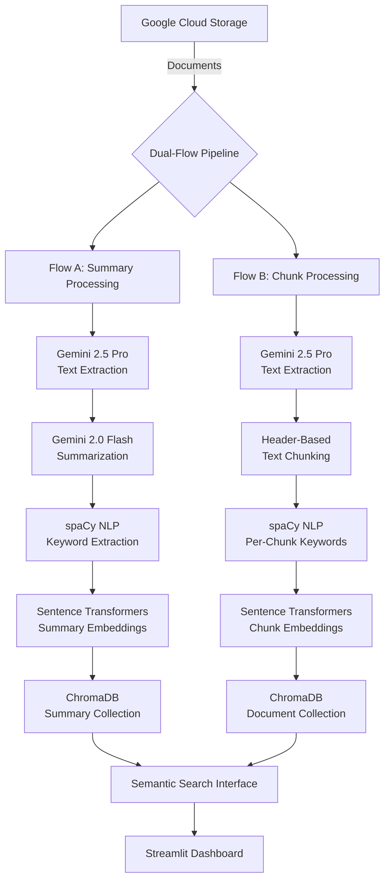

# 🚀 Dual-Flow Document Processing Pipeline

> **Advanced AI-powered document ingestion and processing system with Google Cloud Storage, Gemini AI, and ChromaDB vector storage**

[](https://python.org)
[](https://streamlit.io)
[](https://cloud.google.com)
[](https://trychroma.com)

## 📋 Table of Contents

- [🎯 Overview](#-overview)
- [🏗️ Architecture](#️-architecture)
- [✨ Features](#-features)
- [🛠️ Installation](#️-installation)
- [⚙️ Configuration](#️-configuration)
- [🚀 Usage](#-usage)
- [📊 Monitoring & Analytics](#-monitoring--analytics)
- [🔧 API Reference](#-api-reference)
- [🔬 Technical Details](#-technical-details)
- [🛡️ Security](#️-security)
- [🐛 Troubleshooting](#-troubleshooting)
- [🤝 Contributing](#-contributing)

## 🎯 Overview

The **Dual-Flow Document Processing Pipeline** is a cutting-edge system that automatically processes documents from Google Cloud Storage using advanced AI models. It implements two parallel processing flows to maximize information extraction and storage efficiency.

### 🎪 Key Highlights

- **🔄 Dual-Flow Architecture**: Simultaneous summary-based and chunk-based processing
- **🤖 AI-Powered**: Leverages Google's Gemini 2.5 Pro and Gemini 2.0 Flash models
- **📊 Vector Storage**: ChromaDB cloud integration for semantic search
- **🌐 Web Interface**: Beautiful Streamlit dashboard with real-time monitoring
- **🔍 Smart Processing**: NLP with spaCy and sentence transformers
- **⚡ Scalable**: Multi-threaded processing with configurable workers
- **🛡️ Fault-Tolerant**: Comprehensive error handling and retry mechanisms

## 🏗️ Architecture



### 🎭 Flow Architecture

#### **Flow A: Summary-Based Processing**
1. **📄 Text Extraction**: Gemini 2.5 Pro extracts all text content
2. **📝 Summarization**: Gemini 2.0 Flash creates concise summaries
3. **🏷️ Keyword Extraction**: spaCy identifies key entities and phrases
4. **🧮 Embedding Generation**: Sentence transformers create vector representations
5. **💾 Storage**: Summary and keywords stored in ChromaDB summary collection

#### **Flow B: Chunk-Based Processing**
1. **📄 Text Extraction**: Gemini 2.5 Pro extracts all text content
2. **✂️ Smart Chunking**: Header-based text segmentation using regex patterns
3. **🏷️ Per-Chunk Keywords**: spaCy extracts keywords for each chunk
4. **🧮 Chunk Embeddings**: Individual vector representations for each chunk
5. **💾 Storage**: Chunks and metadata stored in ChromaDB document collection

## ✨ Features

### 🎯 Core Capabilities

- **📁 Multi-Format Support**: PDF, DOC, DOCX, TXT, PNG, JPG, JPEG
- **🔄 Parallel Processing**: Dual-flow architecture for maximum efficiency
- **🤖 Advanced AI Models**: 
  - Gemini 2.5 Pro for text extraction
  - Gemini 2.0 Flash for summarization
- **🧠 NLP Processing**: spaCy for entity recognition and keyword extraction
- **🔍 Semantic Search**: Vector-based similarity search with ChromaDB
- **⚡ High Performance**: Multi-threaded processing with configurable workers
- **📊 Real-time Monitoring**: Live processing status and analytics

### 🌐 Web Interface Features

- **📈 Analytics Dashboard**: Processing statistics and performance metrics
- **🔍 Document Search**: Semantic search across processed documents
- **⚙️ Configuration Panel**: Runtime configuration management
- **🛠️ Setup & Diagnostics**: Dependency checking and system validation
- **📊 Progress Tracking**: Real-time processing status with progress bars

### 🛡️ Enterprise Features

- **🔄 Auto-retry Logic**: Configurable retry attempts with exponential backoff
- **📝 Comprehensive Logging**: Detailed logs with file and console output
- **🔍 Duplicate Detection**: Content-based deduplication using SHA-256 hashes
- **⚡ Batch Processing**: Configurable batch sizes for optimal performance
- **🌐 Cloud-Native**: Designed for Google Cloud Platform integration

## 🛠️ Installation

### 📋 Prerequisites

- **Python 3.13+** (tested with Python 3.13.5)
- **Google Cloud Account** with Storage API enabled
- **Google AI API Key** for Gemini models
- **ChromaDB Cloud Account** (optional, falls back to local)
- **spaCy English Model**: `en_core_web_sm`

### 🔧 Quick Setup

1. **Clone the Repository**
```bash
git clone <repository-url>
cd dual-flow-document-pipeline
```

2. **Create Virtual Environment**
```bash
python -m venv .venv
# Windows
.venv\Scripts\activate
# Linux/Mac
source .venv/bin/activate
```

3. **Install Dependencies**
```bash
pip install -r requirements.txt
```

4. **Download spaCy Model**
```bash
python -m spacy download en_core_web_sm
```

5. **Setup Environment Variables**
```bash
cp .env.example .env
# Edit .env with your credentials
```

## ⚙️ Configuration

### 🔑 Environment Variables

Create a `.env` file in the project root:
```env
# Google AI Configuration
GOOGLE_API_KEY=your_google_api_key_here

# ChromaDB Configuration (Optional)
CHROMA_API_KEY=your_chroma_api_key
CHROMA_TENANT_ID=your_tenant_id

# Google Cloud Storage Configuration
GCS_BUCKET_NAME=your_bucket_name
GCS_BUCKET_PREFIX=optional_prefix/

# Optional: Google Cloud Credentials
GOOGLE_APPLICATION_CREDENTIALS=path/to/service-account.json
```

### ⚙️ Pipeline Configuration

The system uses a `PipelineConfig` dataclass for runtime configuration:

```python
@dataclass
class PipelineConfig:
    # AI Models
    embed_model_name: str = "all-MiniLM-L6-v2"
    gemini_extraction_model: str = "gemini-2.5-pro"
    gemini_summary_model: str = "gemini-2.0-flash"
    
    # Processing Settings
    max_workers: int = 4
    batch_size: int = 10
    retry_attempts: int = 3
    retry_delay: int = 5
    monitoring_interval: int = 30
    
    # Document Support
    supported_extensions: Set[str] = {'.pdf', '.doc', '.docx', '.txt', '.png', '.jpg', '.jpeg'}
    
    # Flow Control
    enable_flow_a: bool = True  # Summary processing
    enable_flow_b: bool = True  # Chunk processing
```

## 🚀 Usage

### 🌐 Web Interface (Recommended)

Launch the Streamlit dashboard:

```bash
streamlit run test.py
```

Navigate to `http://localhost:8501` and use the intuitive web interface:

1. **📊 Dashboard**: Monitor processing status and view analytics
2. **🔍 Search**: Perform semantic searches across processed documents
3. **⚙️ Configuration**: Adjust pipeline settings in real-time
4. **📈 Analytics**: View detailed processing statistics and performance metrics
5. **🛠️ Setup**: Check dependencies and validate system configuration

### 💻 Programmatic Usage

```python
from test import DocumentProcessor, PipelineConfig, PipelineMonitor

# Initialize components
config = PipelineConfig()
monitor = PipelineMonitor()
processor = DocumentProcessor(config, monitor)

# Process documents from GCS bucket
from test import PipelineOrchestrator
orchestrator = PipelineOrchestrator("your-bucket-name")
orchestrator.process_bucket()

# Search processed documents
results = orchestrator.search_documents("your search query", top_k=5)
```

## 📊 Monitoring & Analytics

### 📈 Real-time Dashboard

The Streamlit interface provides comprehensive monitoring:

- **📊 Processing Statistics**: Documents processed, success rates, error counts
- **⏱️ Performance Metrics**: Processing times, throughput analysis
- **🔍 Search Analytics**: Query performance and result relevance
- **📋 System Health**: Component status and resource utilization

### 📝 Logging

Comprehensive logging system with multiple levels:

```python
# Log Configuration
logging.basicConfig(
    level=logging.INFO,
    format='%(asctime)s - %(name)s - %(levelname)s - %(message)s',
    handlers=[
        logging.FileHandler('document_pipeline.log'),
        logging.StreamHandler()
    ]
)
```

### 📊 Analytics Features

- **📈 Processing Trends**: Historical processing performance
- **🎯 Accuracy Metrics**: Content extraction and processing quality
- **🔍 Search Performance**: Query response times and relevance scores
- **⚡ Resource Utilization**: Memory, CPU, and network usage

## 🔧 API Reference

### 🏗️ Core Classes

#### `DocumentProcessor`
Main processing engine for dual-flow document processing.

```python
class DocumentProcessor:
    def __init__(self, config: PipelineConfig, monitor: PipelineMonitor)
    def process_with_retry(self, blob: BlobType, bucket_name: str, 
                          summary_collection: Any, per_doc_collection: Any) -> ProcessingResult
    def is_supported_file(self, filename: str) -> bool
```

#### `PipelineOrchestrator`
High-level orchestration for batch processing.

```python
class PipelineOrchestrator:
    def __init__(self, bucket_name: str)
    def process_bucket(self) -> Dict[str, Any]
    def search_documents(self, query: str, top_k: int = 10) -> List[Dict[str, Any]]
```

#### `GCSBucketMonitor`
Continuous monitoring and processing of GCS bucket changes.

```python
class GCSBucketMonitor:
    def __init__(self, bucket_name: str, processor: DocumentProcessor, 
                 summary_collection: Any, per_doc_collection: Any)
    def start_monitoring(self) -> None
    def stop_monitoring(self) -> None
```

### 📊 Data Models

#### `FlowAResult`
Summary-based processing results.

```python
@dataclass
class FlowAResult:
    doc_id: str
    extracted_text: str
    summary: str
    keywords: List[str]
    summary_embedding: np.ndarray
    keyword_embeddings: np.ndarray
    metadata: DocumentMetadata
```

#### `FlowBResult`
Chunk-based processing results.

```python
@dataclass
class FlowBResult:
    doc_id: str
    chunks: List[Dict[str, Any]]
    total_chunks: int
    metadata: DocumentMetadata
```

## 🔬 Technical Details

### 🧠 AI Models Integration

#### **Gemini 2.5 Pro (Text Extraction)**
- **Purpose**: Extract all textual content from documents
- **Features**: OCR capabilities, multi-format support
- **Configuration**: Configurable via `gemini_extraction_model` parameter

#### **Gemini 2.0 Flash (Summarization)**
- **Purpose**: Generate concise document summaries
- **Features**: Fast processing, context-aware summarization
- **Configuration**: Configurable via `gemini_summary_model` parameter

#### **Sentence Transformers (Embeddings)**
- **Default Model**: `all-MiniLM-L6-v2`
- **Purpose**: Generate vector embeddings for semantic search
- **Features**: 384-dimensional vectors, multilingual support

#### **spaCy NLP (Keyword Extraction)**
- **Model**: `en_core_web_sm`
- **Features**: Named entity recognition, noun phrase extraction
- **Output**: Top 20 keywords per document/chunk

### 🏗️ Vector Storage

#### **ChromaDB Integration**
- **Cloud Support**: ChromaDB Cloud with API key authentication
- **Local Fallback**: Automatic fallback to local ChromaDB instance
- **Collections**: 
  - `summary_collection`: Document summaries and keywords
  - `per_doc_collection`: Individual document chunks

#### **Embedding Strategy**
- **Summary Embeddings**: Single vector per document summary
- **Keyword Embeddings**: Individual vectors for each keyword
- **Chunk Embeddings**: Separate vectors for each document chunk

### ⚡ Performance Optimization

#### **Multi-threading**
- **ThreadPoolExecutor**: Configurable worker threads
- **Batch Processing**: Efficient resource utilization
- **Concurrent Flows**: Parallel Flow A and Flow B processing

#### **Caching Strategy**
- **Streamlit Caching**: Resource caching for AI models and clients
- **Content Deduplication**: SHA-256 hash-based duplicate detection
- **Model Reuse**: Singleton pattern for expensive model initialization

## 🛡️ Security

### 🔐 Authentication & Authorization

- **Google Cloud**: Service account or application default credentials
- **ChromaDB**: API key-based authentication
- **Environment Variables**: Secure credential storage

### 🛡️ Data Security

- **In-Transit Encryption**: HTTPS for all API communications
- **At-Rest Encryption**: Google Cloud Storage encryption
- **Access Control**: Principle of least privilege

### 🔒 Best Practices

- **Credential Management**: Environment variable-based configuration
- **Error Handling**: Comprehensive exception handling without credential exposure
- **Logging**: Sanitized logs without sensitive information

## 🐛 Troubleshooting

### ❌ Common Issues

#### **Import Errors**
```bash
# spaCy model not found
python -m spacy download en_core_web_sm

# Google Cloud dependencies
pip install google-cloud-storage google-generativeai
```

#### **Authentication Issues**
```bash
# Google Cloud authentication
gcloud auth application-default login

# Or set service account key
export GOOGLE_APPLICATION_CREDENTIALS="path/to/service-account.json"
```

#### **ChromaDB Connection**
```python
# Check ChromaDB configuration
CHROMA_API_KEY=your_api_key
CHROMA_TENANT_ID=your_tenant_id
```

### 🔍 Debug Mode

Enable detailed logging:

```python
import logging
logging.getLogger().setLevel(logging.DEBUG)
```

### 📊 Performance Issues

- **Memory Usage**: Reduce `batch_size` and `max_workers`
- **Processing Speed**: Increase `max_workers` (up to CPU cores)
- **API Limits**: Implement rate limiting and backoff strategies

## 🤝 Contributing

### 🛠️ Development Setup

1. **Fork the Repository**
2. **Create Feature Branch**
   ```bash
   git checkout -b feature/amazing-feature
   ```
3. **Install Development Dependencies**
   ```bash
   pip install -r requirements-dev.txt
   ```
4. **Run Tests**
   ```bash
   pytest tests/
   ```

### 📝 Code Standards

- **Type Hints**: Comprehensive type annotations
- **Documentation**: Detailed docstrings for all functions
- **Linting**: Pylance-compliant code
- **Testing**: Unit tests for critical components

### 🎯 Areas for Contribution

- **🔌 New Document Formats**: Additional file type support
- **🤖 AI Model Integration**: Alternative AI providers
- **🔍 Search Enhancement**: Advanced query capabilities
- **📊 Analytics Features**: Extended monitoring and reporting
- **🌐 Deployment**: Docker containerization and Kubernetes support

---

## 📄 License

This project is licensed under the MIT License - see the [LICENSE](LICENSE) file for details.

## 🙏 Acknowledgments

- **Google Cloud Platform** for AI and storage services
- **ChromaDB** for vector database capabilities
- **Streamlit** for the beautiful web interface
- **spaCy** for NLP processing
- **Sentence Transformers** for embedding generation

---

<div align="center">

**🚀 Built with ❤️ for efficient document processing**

[](https://python.org)
[](https://ai.google.dev)

</div>
4. **Vector Storage**: The embeddings and associated metadata (e.g., filename, source) are stored in their respective ChromaDB collections (`summary_collection` and `per_doc_collection`).

### Search Flow

1. **Query Embedding**: The user's text query is converted into a vector embedding using the same `SentenceTransformer` model.
2. **Semantic Search**: This query vector is used to perform a similarity search against both the `summary_collection` and `per_doc_collection`. ChromaDB returns the most semantically similar documents or chunks.
3. **Result Display**: The application displays the search results, including the matching text, its source, and a similarity score (distance). It also highlights keywords from the original query within the results for improved readability.
