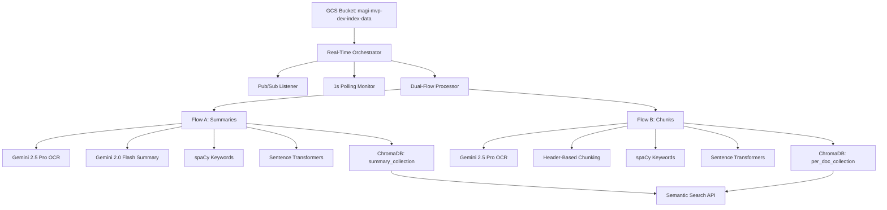

# 🚀 MAGi OCR Real-Time Document Processing Pipeline

[](https://fastapi.tiangolo.com/)
[](https://www.python.org/downloads/)
[](https://cloud.google.com/)
[](https://ai.google.dev/)
[](https://www.trychroma.com/)

A **production-ready, real-time document processing pipeline** built with FastAPI that combines **Google Cloud Storage**, **Pub/Sub**, **Gemini AI**, **ChromaDB Cloud**, and advanced NLP for intelligent document ingestion with dual-flow architecture and **1-second real-time monitoring**.

## ✨ Key Features

### 🔀 **Dual-Flow Architecture**

- **Flow A (Summary Processing)**: Document → Gemini 2.5 Pro OCR → Gemini 2.0 Flash Summarization → ChromaDB Summary Collection
- **Flow B (Chunk Processing)**: Document → Gemini 2.5 Pro OCR → Header-Based Chunking → ChromaDB Per-Doc Collection
- **Concurrent Processing**: Both flows execute simultaneously with ThreadPoolExecutor optimization

### ⚡ **Real-Time Monitoring**

- **1-Second Polling**: Near-instantaneous document detection
- **Pub/Sub Integration**: Google Cloud Pub/Sub for instant notifications
- **Dual Detection**: Polling + Pub/Sub fallback for maximum reliability
- **Live Statistics**: Real-time processing metrics and performance tracking

### 🤖 **Advanced AI Processing**

- **Gemini 2.5 Pro**: State-of-the-art OCR and text extraction from PDFs, images
- **Gemini 2.0 Flash**: High-speed AI summarization with rate limiting
- **spaCy NLP**: Intelligent keyword extraction and text analysis
- **Sentence Transformers**: 384-dimensional embeddings for semantic search

### 🔍 **Semantic Search & Storage**

- **ChromaDB Cloud**: Production-grade vector database with cloud hosting
- **Dual Collections**: Separate storage for summaries (`summary_collection`) and chunks (`per_doc_collection`)
- **Vector Search**: Cosine similarity-based semantic retrieval
- **Metadata Enrichment**: Full document metadata, keywords, and processing statistics

### 📊 **Enterprise Features**

- **RESTful API**: 15+ endpoints for complete pipeline control
- **Real-Time Analytics**: Processing statistics, success rates, error tracking
- **Folder Filtering**: Advanced GCS path filtering with include/exclude patterns
- **Scalable Processing**: Configurable worker pools and batch sizes
- **Health Monitoring**: Comprehensive system status and diagnostics

## 🏗️ Architecture Overview



## 🚀 Quick Start

### Prerequisites

- Python 3.8+
- Google Cloud Project with GCS and Pub/Sub enabled
- ChromaDB Cloud account
- Gemini AI API key

### 1. Installation

```bash
# Clone repository
git clone <repository-url>
cd "Test MAGi OCR POC Backend"

# Create virtual environment
python -m venv .venv

# Activate virtual environment
# Windows:
.venv\Scripts\activate
# Linux/Mac:
source .venv/bin/activate

# Install dependencies
pip install -r requirements.txt
```

### 2. Environment Configuration

Create `.env` file in the project root:

```env
# Google Cloud Configuration
GOOGLE_CLOUD_PROJECT=magi-mvp-dev
GCS_BUCKET_NAME=magi-mvp-dev-index-data
GCS_BUCKET_PREFIX=inspection_docs

# Pub/Sub Configuration (Optional)
ENABLE_PUBSUB=true
PUBSUB_SUBSCRIPTION_NAME=document-processing-sub

# Gemini AI Configuration
GEMINI_API_KEY=your_gemini_api_key_here

# ChromaDB Cloud Configuration
CHROMA_HOST=api.trychroma.com
CHROMA_PORT=443
CHROMA_API_KEY=your_chroma_api_key
CHROMA_TENANT=your_tenant_id
CHROMA_DATABASE=vector_db

# Processing Configuration
MONITORING_INTERVAL=1
MAX_WORKERS=3
BATCH_SIZE=10
```

### 3. Google Cloud Setup

```bash
# Install Google Cloud SDK
# Set up authentication
gcloud auth login
gcloud config set project magi-mvp-dev

# Create Pub/Sub subscription (optional)
gcloud pubsub subscriptions create document-processing-sub \
  --topic=your-topic-name
```

### 4. Run the Server

```bash
# Development mode (with auto-reload)
uvicorn test:app --host 127.0.0.1 --port 8000 --reload

# Production mode
uvicorn test:app --host 0.0.0.0 --port 8000

# Background process (Windows)
Start-Process -FilePath ".venv/Scripts/python.exe" -ArgumentList "-m","uvicorn","test:app","--host","127.0.0.1","--port","8000" -NoNewWindow
```

### 5. Verify Installation

```bash
# Check server health
curl http://127.0.0.1:8000/pipeline/status

# View API documentation
# Open: http://127.0.0.1:8000/docs
```

## 📖 API Documentation

### Core Pipeline Endpoints

#### Pipeline Management

- `POST /pipeline/start` - Initialize pipeline with configuration
- `GET /pipeline/status` - Get current pipeline status
- `POST /pipeline/process` - Process documents with monitoring
- `POST /pipeline/stop` - Stop pipeline gracefully

#### Real-Time Monitoring

- `GET /monitoring/realtime/status` - Get comprehensive monitoring status
- `POST /monitoring/realtime/start` - Start enhanced real-time monitoring
- `POST /monitoring/realtime/stop` - Stop real-time monitoring
- `GET /monitoring/realtime/test` - Test real-time detection capability

#### Document Processing

- `POST /documents/process` - Process specific document
- `GET /flows/status` - Get dual-flow processing statistics

#### Search & Retrieval

- `POST /search/summary` - Search Flow A summary collection
- `POST /search/chunks` - Search Flow B chunks collection
- `POST /search` - General document search

#### ChromaDB Management

- `GET /chromadb/collections` - View all collections and counts
- `GET /chromadb/collection/{name}/sample` - Get sample documents
- `GET /chromadb/search-test` - Test search functionality

#### Analytics & Debug

- `GET /analytics` - Processing statistics and performance metrics
- `GET /debug/bucket-structure` - GCS bucket structure analysis
- `GET /debug/filter-preview` - Preview folder filtering results
- `POST /debug/test-filter` - Test custom filter settings

### Request/Response Examples

#### Start Pipeline

```bash
curl -X POST "http://127.0.0.1:8000/pipeline/start" \
  -H "Content-Type: application/json" \
  -d '{
    "bucket_name": "magi-mvp-dev-index-data",
    "process_existing": true,
    "enable_monitoring": true,
    "enable_realtime": true,
    "include_folders": ["inspection_docs/"],
    "max_workers": 3,
    "monitoring_interval": 1
  }'
```

#### Search Documents

```bash
# Search summaries
curl -X POST "http://127.0.0.1:8000/search/summary" \
  -H "Content-Type: application/json" \
  -d '{
    "query": "maintenance inspection report",
    "top_k": 5
  }'

# Search chunks
curl -X POST "http://127.0.0.1:8000/search/chunks" \
  -H "Content-Type: application/json" \
  -d '{
    "query": "dimensional specifications",
    "top_k": 3
  }'
```

## 🔧 Configuration Options

### Processing Configuration

```python
# In test.py CONFIG class
monitoring_interval: int = 1          # Real-time monitoring (1-300s)
max_workers: int = 3                  # Concurrent processing threads
batch_size: int = 10                  # Document batch size
max_retries: int = 3                  # Gemini API retry attempts
```

### Folder Filtering

```python
include_folders: Optional[List[str]] = ["inspection_docs/"]
exclude_folders: List[str] = ["temp/", "archive/"]
root_only: bool = False               # Process root files only
folder_depth_limit: int = 10          # Maximum folder depth
```

### AI Model Configuration

```python
# Gemini Models
extraction_model = "gemini-2.5-pro"   # OCR and text extraction
summary_model = "gemini-2.0-flash-exp" # Fast summarization

# Embedding Model
embedding_model = "all-MiniLM-L6-v2"  # Sentence transformers
embedding_dimension = 384              # Vector dimensions
```

## 📊 Monitoring & Analytics

### Real-Time Statistics

The pipeline provides comprehensive monitoring through `/monitoring/realtime/status`:

```json
{
  "status": "active",
  "monitoring_active": true,
  "pubsub_active": true,
  "bucket": "magi-mvp-dev-index-data",
  "statistics": {
    "total_processed": 15,
    "realtime_processed": 8,
    "polling_processed": 7,
    "realtime_percentage": 53.3,
    "polling_percentage": 46.7,
    "last_detection": "2025-10-10T15:30:45.123456",
    "monitoring_interval_seconds": 1
  }
}
```

### Processing Analytics

Access detailed processing metrics via `/analytics`:

```json
{
  "analytics": {
    "total_documents": 25,
    "successfully_processed": 24,
    "processing_errors": 1,
    "success_rate": 96.0,
    "recent_documents": ["inspection_docs/report1.pdf"],
    "flow_statistics": {
      "flow_a_summary_count": 24,
      "flow_b_chunk_count": 24,
      "flow_a_success_rate": 100.0,
      "flow_b_success_rate": 100.0
    }
  }
}
```

## � Search Capabilities

### Semantic Search Features

- **Multi-Collection Search**: Search across summaries or document chunks
- **Similarity Scoring**: Cosine similarity with relevance ranking
- **Metadata Filtering**: Search with document metadata constraints
- **Flexible Results**: Configurable result count (1-20 documents)

### Search Response Format

```json
{
  "query": "inspection report",
  "collection": "summary_collection",
  "flow": "A",
  "results": [
    {
      "id": "doc_id_hash",
      "content": "Document summary content...",
      "metadata": {
        "filename": "inspection_docs/report.pdf",
        "flow": "A",
        "keywords": "inspection, maintenance, safety"
      },
      "similarity_score": 0.85,
      "flow": "A - Summary"
    }
  ],
  "total_results": 1
}
```

## 🏭 Production Deployment

### Docker Deployment

```dockerfile
FROM python:3.11-slim

WORKDIR /app
COPY requirements.txt .
RUN pip install -r requirements.txt

COPY . .
EXPOSE 8000

CMD ["uvicorn", "test:app", "--host", "0.0.0.0", "--port", "8000"]
```

### Environment Variables

```bash
# Production environment
export ENVIRONMENT=production
export LOG_LEVEL=INFO
export MAX_WORKERS=5
export MONITORING_INTERVAL=5
export ENABLE_PUBSUB=true
```

### Health Checks

```bash
# Kubernetes health check
curl -f http://localhost:8000/pipeline/status || exit 1

# Docker health check
HEALTHCHECK --interval=30s --timeout=10s --start-period=5s --retries=3 \
  CMD curl -f http://localhost:8000/ || exit 1
```

## 🔒 Security Considerations

### Authentication

- ChromaDB API key authentication
- Google Cloud service account credentials
- Gemini API key management
- Environment variable security

### Network Security

- HTTPS/SSL for ChromaDB Cloud connections
- VPC network isolation for GCS access
- API rate limiting and quota management
- Input validation and sanitization

## 🚨 Troubleshooting

### Common Issues

#### Pub/Sub 404 Errors

```bash
# Verify subscription exists
gcloud pubsub subscriptions list

# Check IAM permissions
gcloud projects get-iam-policy magi-mvp-dev
```

#### Gemini API Rate Limits

- Check API quota in Google Cloud Console
- Verify API key validity and permissions
- Monitor rate limiting logs for backoff behavior

#### ChromaDB Connection Issues

- Verify API key and tenant configuration
- Check network connectivity to api.trychroma.com
- Review ChromaDB Cloud dashboard for service status

#### Document Processing Failures

- Check GCS bucket permissions
- Verify supported file formats (PDF, images)
- Monitor Gemini API response times and errors

### Debug Mode

```bash
# Enable debug logging
export LOG_LEVEL=DEBUG
uvicorn test:app --log-level debug

# Check processing statistics
curl http://127.0.0.1:8000/debug/bucket-structure
curl http://127.0.0.1:8000/debug/filter-preview
```

## � Dependencies

### Core Dependencies

- **FastAPI**: Modern web framework for APIs
- **Uvicorn**: ASGI server for FastAPI
- **Google Cloud Storage**: Document storage and monitoring
- **Google Cloud Pub/Sub**: Real-time notifications
- **ChromaDB**: Vector database for embeddings
- **Sentence Transformers**: Text embeddings
- **spaCy**: Natural language processing
- **Google Generative AI**: Gemini models for OCR/summarization

### Full Requirements

See [requirements.txt](requirements.txt) for complete dependency list with versions.

## 📄 License

This project is licensed under the MIT License - see the [LICENSE](LICENSE) file for details.

## �‍♂️ Support

### Documentation

- **API Docs**: <http://127.0.0.1:8000/docs> (when server is running)
- **Alternative Docs**: <http://127.0.0.1:8000/redoc>

### Issues

For technical issues, feature requests, or questions:

1. Check existing documentation
2. Review troubleshooting section
3. Create detailed issue report with logs

---

### Built with ❤️ for intelligent document processing

Real-time • Scalable • Production-Ready

## 🤝 Contributing

1. Fork the repository
2. Create your feature branch (`git checkout -b feature/AmazingFeature`)
3. Commit your changes (`git commit -m 'Add some AmazingFeature'`)
4. Push to the branch (`git push origin feature/AmazingFeature`)
5. Open a Pull Request

## 🙏 Acknowledgments

- **FastAPI** - Modern, fast web framework for building APIs
- **Google Cloud** - Cloud storage and AI services  
- **Gemini AI** - Advanced language models (2.5 Pro + 2.0 Flash) for document processing
- **ChromaDB Cloud** - Production-grade vector database with cloud hosting
- **spaCy** - Industrial-strength natural language processing
- **Sentence Transformers** - State-of-the-art 384-dimensional text embeddings

---

Built with ❤️ for intelligent dual-flow document processing with real-time monitoring
